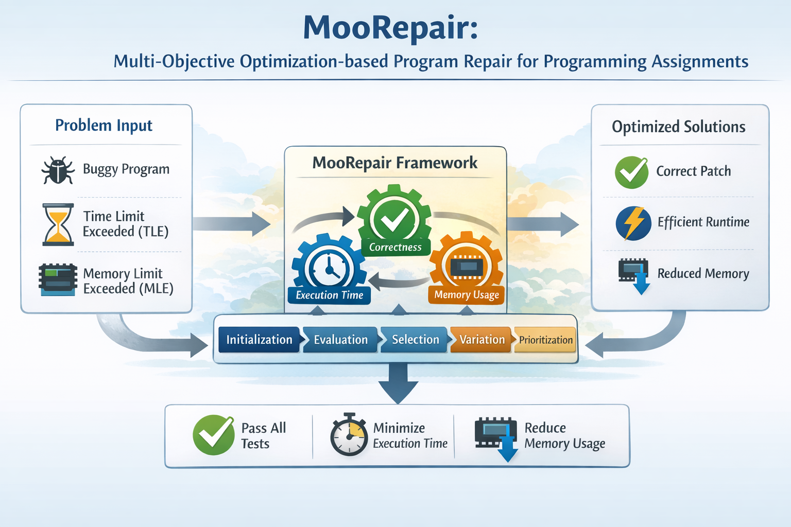

# MooRepair: Multi-Objective Optimization-based Program Repair for Programming Assignments

<!--  -->
<div align="center">

</div>

## Setup

1. Environment
   `Ubuntu`
   `python >= 3.13`

2. (Optional) Virtual Environment
   ```bash
   python3 -m venv env
   source env/bin/activate
   ```

3. Install Packages

   ```bash
   pip install -r requirements.txt
   ```

4. Load Dataset

   ```bash
   python dataset.py build --language "Python 3"
   python dataset.py verify
   python dataset.py summary
   ```

5. LLM API Key Setting

   Create a `.env` file in the project root with the keys:
   ```
   OPENAI_API_KEY="your_api_key_here"
   ```


## How to Run
0. Fast Run

   ```bash
   python run.py -d data/670_B -s
   ```

1. MooRepair (GPT-3.5-Turbo)

   ```bash
   python run.py -d data -a MooRepair -g 4 -p 6
   ```

2. PaR+EffiLearner (GPT-3.5-Turbo)

   ```bash
   python run.py -d data -a PaREL -g 5 -p 6
   ```

## Run Options

| Option | Long Option     | Description                                     | Default        |
|--------|-----------------|-------------------------------------------------|----------------|
| `-d`   | `--dataset`     | Path to dataset directory or JSON file          | (required)     |
| `-a`   | `--approach`    | Approach to run: `PaREL`, `MooRepair` (`PaREL` also records PaR-only results) | `MooRepair`    |
| `-ab`  | `--ablation`    | Ablate one MooRepair component (see below)      | `None`         |
| `-g`   | `--generations` | Number of generations                           | `4`            |
| `-p`   | `--popsize`     | Population size                                 | `6`            |
| `-l`   | `--llm`         | LLM model name (LiteLLM format, e.g. `ollama/codellama:7b`) | `gpt-3.5-turbo`|
| `-ap`  | `--api-base`    | API base URL for self-hosted servers (Ollama/vLLM) | `None`      |
| `-t`   | `--temperature` | LLM sampling temperature                        | `0.8`          |
| `-to`  | `--timeout`     | Per-call LLM timeout in seconds (raise for slow local models) | `60` |
| `-s`   | `--sampling`    | Use 10% sampling of buggy programs              | `False`        |
| `-r`   | `--reset`       | Reset experiments results                       | `False`        |

### Ablation Options (`-ab`, only with `-a MooRepair`)

| Value           | Ablated component                                            |
|-----------------|--------------------------------------------------------------|
| `random`        | ALL selection steps (survivor/strategy/pairing) → random     |
| `no_crossover`  | Mutation-only variation (operator applied twice, budget-matched) |
| `no_mutation`   | Crossover-only variation (operator applied twice, budget-matched) |
| `rand_survivor` | NSGA-II survivor selection → random sampling                 |
| `rand_strategy` | SUS repair-strategy assignment → random strategy             |
| `rand_pairing`  | Complementarity parent pairing → random pairing              |
| `no_early_stop` | Early termination criterion disabled                         |
